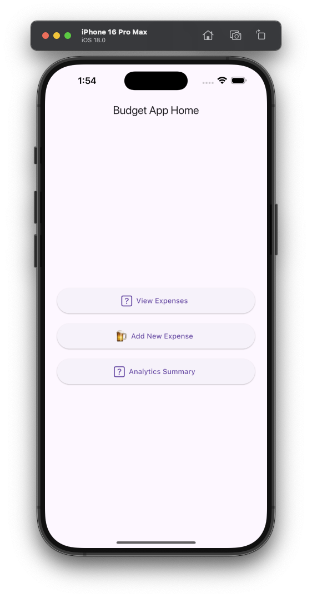

# Project Documentation: BudgetApp

## Overview

BudgetApp is a cross-platform expense tracking application built using Flutter. It allows users to add, view, and delete daily expenses with category labels and descriptions. Data is stored locally using the Hive database.

## Technology Stack

- **Framework**: Flutter (Dart)
- **Local Storage**: Hive
- **IDE**: Visual Studio Code, Xcode
- **Platforms Tested**:
  - Chrome (Web)
  - iPhone 12 Pro (Physical Device)
  - iPad Pro (iOS Simulator)

## Directory Structure

```
budget_app/
├── lib/
│   ├── models/
│   │   └── expense.dart
│   ├── screens/
│   │   └── expense_list_screen.dart
│   └── services/
│       └── hive_service.dart
├── test/
│   ├── expense_list_screen_test.dart
│   └── widget_test.dart
├── ios/
├── android/
├── web/
└── README.md
```

## Testing

### Test Types
- **Widget Tests**: Validate UI rendering and element presence
- **Integration Tests**: Simulate user interactions (future implementation)

### Running Tests
```bash
flutter test
```

## iOS Deployment Notes

- Tested using Xcode simulator and real device (iPhone 12 Pro).
- Automatic signing and Apple developer account setup required.
- App verified through device settings after building.

## Git & GitHub

- Main development occurs in the `main` branch.
- Features and documentation updates are pushed to separate branches like `ReadMeUpdate`.
- Pull requests used to merge into `main`.

## Known Issues

- Hive test box conflicts during multiple test file runs.
- Platform plugin initialization during testing may need stubbing/mocking.

## Screenshots

### Home Screen


### Add Expense Screen


### Running on iOS Simulator


### Running on iPhone 12 Pro


## Author

Will Kafanga